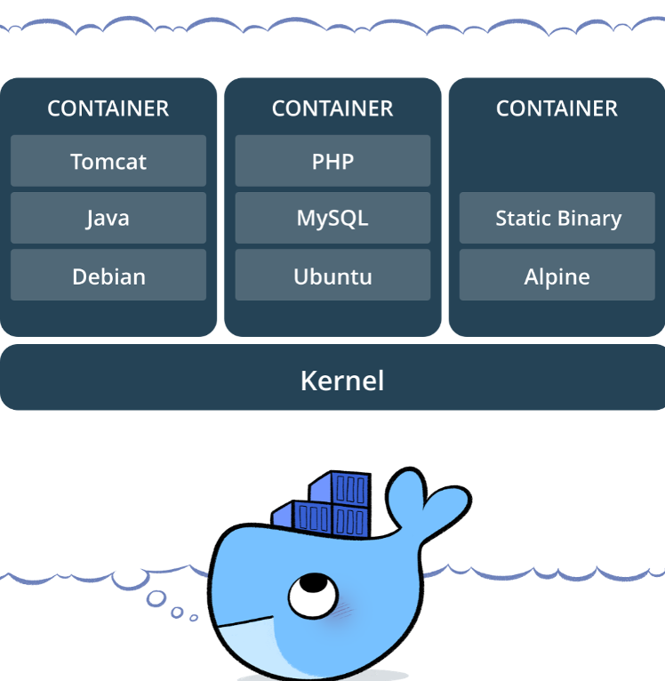
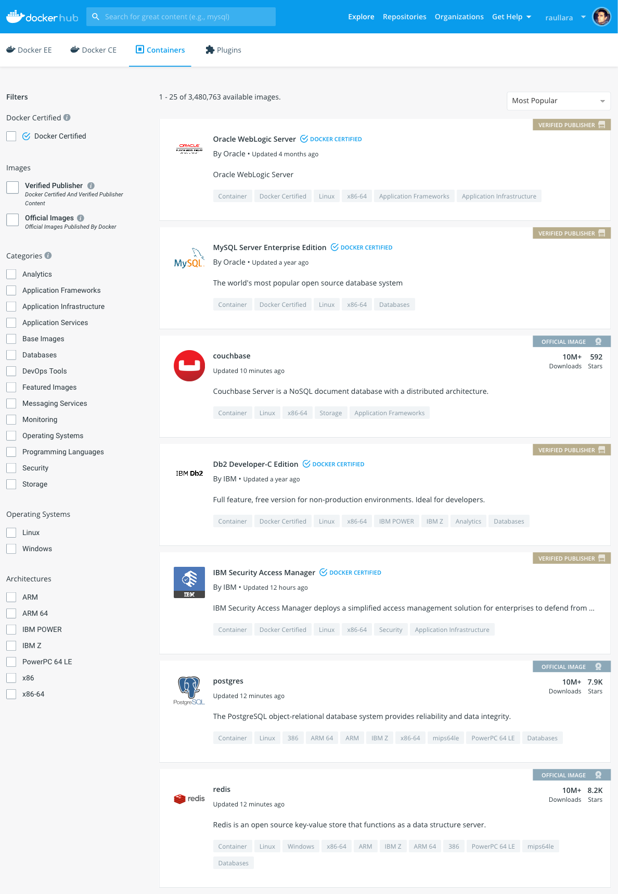

# I AM A DEVELOPER, WHY SHOULD I CARE ABOUT DOCKER?

Raúl Lara Cabrera
Universidad Politécnica de Madrid


---

Docker is all about containers:

* Kind of a **very** lightweight VM.
* Works directly on top of the host OS kernel.
* **Everything** an application needs to work, sandboxed.
* If the user is able to run **Docker**, then the application runs flawlessly.



---

## Docker kind of users

1. Consumer:

>I'm not into development, but I need to use applications and services that are often difficult to install and setup.

2. Producer:

>I'm a developer and I want to distribute my application so it is as easy to setup as possible. In the meantime, I need to test in environments as close to production as possible

3. ~~SysAdmin~~: out of scope!

---

#### Docker Hub



* Hosted repository of containerized applications and services.
* Free, but Docker account required.
* Community driven.
* Official container images.

---

#### Dockerfile

Specification of what your containerized application is made of and how does it work:

```docker
FROM ubuntu:latest
RUN apt-get update -y
RUN apt-get install -y python-pip python-dev build-essential
COPY requirements.txt /usr/src/app/
RUN pip install --no-cache-dir -r /usr/src/app/requirements.txt
EXPOSE 5000
CMD ["python", "/usr/src/app/app.py"]
```

Think about it as a *script for creating and deploying* an application.

---

<!-- _class: lead -->
# HANDS ON:

## LET'S DOCKER!

---

### DOCKER USE CASES

* Running services and applications effortlessly.
* Testing and running applications in ephemereal containers that mimmick a production environment.
* Distributing not only an application but also its requirements altogether in the same container.
* Reproducible science: code, libraries, experiments and configs that run in the same environment (container).
* Cloud computing, Kubernetes clusters, High Performance Computing, ...
